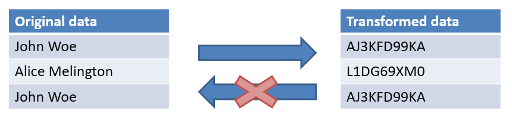

## Introduction

This document presents the datasets generated for Scava, discusses the implications it has regarding privacy, and describes what has been achieved to ensure data is safe.

All datasets are anonymised: fields that could be used to identify individuals or companies either directly or indirectly have been transformed using the [Anonymise::Utility Perl module](https://github.com/borisbaldassari/data-anonymiser).

The intended audience of the datasets is composed of:

* Research laboratories, mainly in the field of software engineering. 
* Software engineering practitioners, who may find useful to have real-world examples of software development projects. 

Should one have questions or remarks on the datasets, please [feel free to contact us](https://www.crossminer.org/contact). All cases related to privacy will be handled with utmost diligence.

## Description of the datasets

There are three types of datasets generated, each with its specific schema and attributes. The first step to preserve privacy is to describe the various datasets and their attributes, and identify what field could pose a threat.

### AERI stacktraces

The [AERI stacktraces dataset](http://download.eclipse.org/scava/datasets/aeri_stacktraces/aeri_stacktraces.html) contains information about exceptions encountered by users in the Eclipse IDE. It includes data about the exception itself, and the environment where it happened.

The [incidents dataset](../datasets/aeri_stacktraces/aeri_stacktraces.html#format-incidents) offers the following attributes:

* **Message** (String) A short text summarising the error.
* **Code** (Integer) The numeric status code logged with the error.
* **Severity** (Factors) An estimate by the user reporting the error about its perceived severity.
* **Kind** (Factors) The type of error recorded, as identified by the AERI system.
* **Plugin ID** (String) The ID of the Eclipse plugin that threw the exception.
* **Plugin Version** (String) The ID of the Eclipse plugin that threw the exception.
* **Status fingerprint** (String) An identifier for the status of the incident. Used for duplicates detection.
* **Incident fingerprint** (String) An identifier for the incident. Used for duplicates detection.
* **Incident fingerprint2** (String) An identifier for the incident. Used for duplicates detection.
* **Timestamp** (Date ISO 8601) The time of creation of the incident.
* **Saved On** (Date ISO 8601) The time of last save of the problem.
* **OSGi Architecture** (Factors) The architecture of the host, as specified in the OSGi bundle definition.
* **OSGi OS** (Factors) The host operating system, as reported in OSGi.
* **OSGi OS Version** (Factors) The host operating system version, as reported in OSGi.
* **OSGi Window Manager** (Factors) The Window Manager used by the host, as reported in OSGi.
* **Eclipse Build ID** (String) The Build ID of the Eclipse instance running when the exception occurred.
* **Eclipse Product** (String) The Eclipse product impacted by the exception.
* **Java runtime version** (String) The Java runtime of the host.
* **Comment Quality** (Factors) An estimate of the user comment’s quality (throughfulness). User comments help people better understand the context of the exception.

The [problems dataset](../datasets/aeri_stacktraces/aeri_stacktraces.html#format-problems) offers the following attributes:

* **Summary** (String) A short text summarising the error.
* **Number of reporters** (Integer) The number of people who reported this incident or problem.
* **Number of incidents** (integer) The number of times this problem was identified in incidents.
* **V1 Status** (Factors) The status of the problem attached to the error report.
* **Kind** (Factors) The type of error recorded, as identified by the AERI system.
* **Created On** (Date ISO 8601) The time of first appearance of the problem in an incident.
* **Modified On** (Date ISO 8601) The time of last update of the problem in an incident.
* **Saved On** (Date ISO 8601) The time of last save of the problem.
* **OSGi Architecture** (Factors) The architecture of the host, as specified in the OSGi bundle definition.
* **OSGi OS** (Factors) The host operating system, as reported in OSGi.
* **OSGi OS Version** (Factors) The host operating system version, as reported in OSGi.
* **OSGi Window Manager** (Factors) The Window Manager used by the host, as reported in OSGi.
* **Eclipse Build ID** (String) The Build ID of the Eclipse instance running when the exception occurred.
* **Eclipse Product** (String) The Eclipse product impacted by the exception.
* **Java runtime version** (String) The Java runtime of the host.

The [incidents bundle](http://download.eclipse.org/scava/datasets/aeri_stacktraces/incidents_bundles_extract.csv.bz2) offers the following attributes:

* **Bundle name** (String) The name of the bundle impacted by the exception.
* **Bundle version** (String) The version of the bundle impacted by the exception.
* **Value** (Integer) The number of times the exception appeared for this bundle (name + version).

### Eclipse Mailing lists

The [Eclipse mailing lists dataset](../datasets/eclipse_mls/mbox_analysis.html) offers the following attributes:

* **List** (String) The mailing list and project of the post.
* **messageId** (String) A unique identifier for the post.
* **Subject** (String) The subject of the post as sent on the mailing list.
* **Sent at** (Date ISO 8601) The time of sending for the post.
*  :biohazard:  **Sender name** (String) The name of the sender of the post. Names are obfuscated, e.g. `HKmwHIC4dREThJRj`.
*  :biohazard:  **Sender address** (String) The email address of the sender of the post. Email address is obfuscated, e.g. `xzrEaN24LhYew151@HAYhBP6A1UVpXiHt`.

### Eclipse projects extracts

The [Eclipse projects extracts](../datasets/projects/eclipse_projects.html) have different sets of data depending on the sources available for each project. We list thereafter the full list of extracts, highlighting attributes that include privacy-related information.

Git (Software Configuration Management)
* **git_commits_evol.csv** contains the daily number of commits and distinct authors. 
*  :biohazard:  **git_log.txt** contains the retranscription of the `git log`command, including the name and email of commit authors. Name is replaced by XXX's and email address is obfuscated, e.g. `xzrEaN24LhYew151@HAYhBP6A1UVpXiHt`.

Bugzilla (Issue tracking)
* **bugzilla_components.csv** contains the number of issues submitted against each component.
* **bugzilla_evol.csv** contains the daily number of issues submitted and distinct authors.
*  :biohazard:  **bugzilla_issues.csv** contains the list of issues for the project, including the emails of the author and the assignee for each submitteed issue. Emails are obfuscated, e.g. `xzrEaN24LhYew151@HAYhBP6A1UVpXiHt`.
*  :biohazard:  **bugzilla_issues_open.csv** contains the list of open issues for the project, including the emails of the author and the assignee for each submitteed issue. Emails are obfuscated, e.g. `xzrEaN24LhYew151@HAYhBP6A1UVpXiHt`.

Forums (User-oriented communication)
* **eclipse_forums_posts.csv** contains the full list of posts on the project's forum. It includes an Integer representation of the author of the post as returned by the API (no obfuscation needed).
* **eclipse_forums_threads.csv** contains the full list of posts on the project's forum. It includes an Integer representation of the first and last author of the thread, as returned by the API (no obfuscation needed).

PMI (project metadata)
* **eclipse_pmi_checks.csv** contains a list of checks (values, usefulness, consistency) applied to the Project Management Infrastructure record for the project.

SonarQube (code analysis)
* **sq_issues_blocker.csv** contains the list of SonarQube issues with severity set to blocker.
* **sq_issues_blocker.csv** contains the list of SonarQube issues with severity set to critical.
* **sq_issues_blocker.csv** contains the list of SonarQube issues with severity set to major.
* **sq_metrics.csv** contains the list of metrics computed by Sonarqube.

## Anonymisation

The mechanism used to anonymise the data is the [Anonymise::Utility Perl module](https://github.com/borisbaldassari/data-anonymiser). It basically uses asymmetric encryption to generate a one-off mapping between clear IDs and obfuscated strings. 

The private key is thrown away, preventing any recovering of the encrypted IDs. This technique has several advantages: 

* Identical clear-text strings are translated to the same obfuscated string. This enables researchers and analysts to identify same occurrences of an item without any information about its actual content.
* The private key is thrown away immediately, making it impossible for an attacker to use it to decrypt the dataset. The algorithm used is the [Perl implementation of RSA](https://metacpan.org/pod/Crypt::PK::RSA), which is considered reasonably strong for our purpose.
* The public key is re-generated for each session, making it impossible for an attacker to rebuild the mapping or use rainbow tables.

**The resulting datasets contain no email address, names, user id or machine id. **

## Privacy compliance

The management and publication of data in the European Union is regulated by the **General Data Protection Regulation** (GDPR) directive, which also addresses the export of data outside the EU and EEA areas. Since we are EU citizens -- and considering also that the Crossminer project is funded by the H2020 EU research program -- we are to abide by this regulation. Besides the legal implications of publishing open datasets, we are willing to make sure that everybody, individuals or companies, involved in the data is safe.

The publication of open data in this context, i.e. with the original data being already publicly available from public tools, is a specific case of the GDPR and it is hard to find any reliable information about how it should be conducted. As a result we relied on similar studies and articles and proceeded on a best-effort basis to provide as useful and safe as possible datasets to our users.

Considering that:

* **Original data is already publicly available** through the tools themselves (Git, Bugzilla, Mailing lists and forums) and their APIs. 
* We provide a **complete description** of the content of the datasets, **identifying the risks** and **describing the mitigation steps** we went through to ensure that the data is safe.
* To the best of our knowledge **there is now way to decrypt or reverse-engineer the obfuscated information**.

Considering also that:
* The goal of this processing is to provide **free and open resources to help scientific research**, which is in the **public interest** as defined in [Article 6.1 (e)](https://gdpr-info.eu/art-6-gdpr/).
* The Eclipse forge hosts open source and collaborative projects only, and all contributions are made under a quite [**strict contributor license agreement**](https://www.eclipse.org/legal/ECA.php): people knowingly gave their consent to make their contribution public.

We assume that both the data itself and its publication are safe, regarding both the users and the current regulation.

## References

